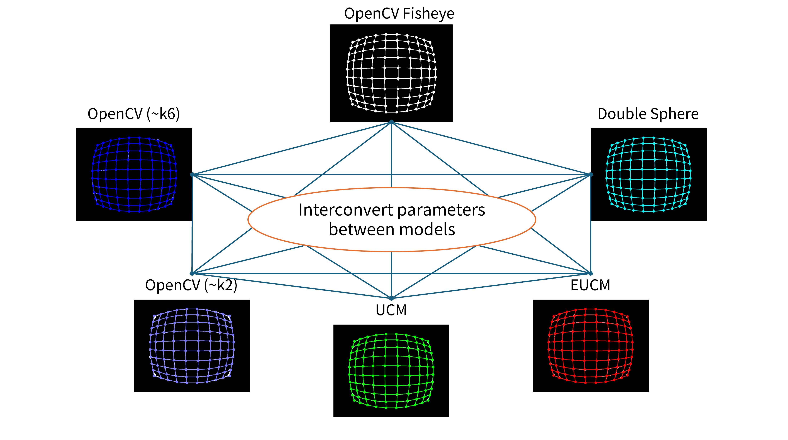

# Camera Model Converter

Do you want to convert one camera model to another (especially fisheye)?

Are you looking to deploy camera parameters estimated using a calibration algorithm that supports Camera Model A into a system that does not support Camera Model A but supports Camera Model B?

This repo may help you...

## Overview

## Algorithm
1. Take grid points on 2D image space.
2. Optimize the destination camera model parameters to match distorted points with the ones distorted by the source camera model.

## Other camera models
Please inherit `CameraModelBase` and implement `distort()`.